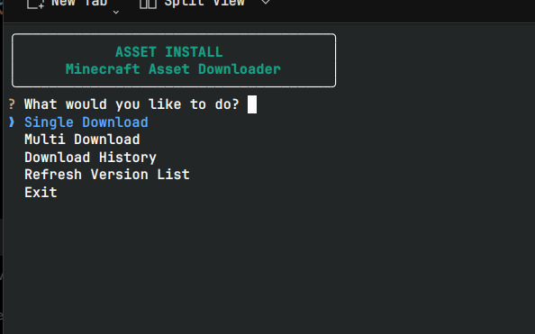
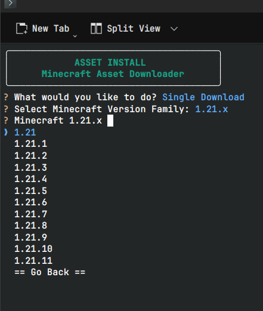
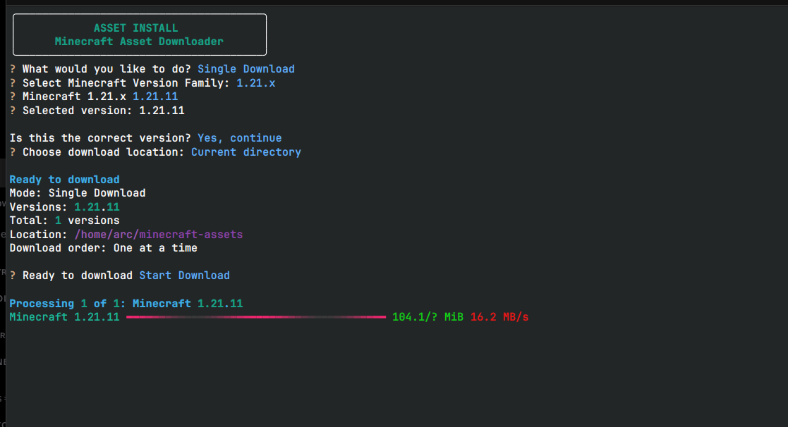
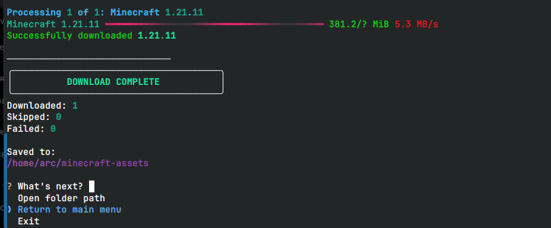

# Asset Install

Download original Minecraft assets from any Java Edition version directly from your terminal.

[](https://github.com/ARCns09/Asset-Install/actions/workflows/tests.yml)
[](https://github.com/ARCns09/Asset-Install/releases)
[](https://github.com/ARCns09/Asset-Install/blob/main/LICENSE)
[](https://python.org)

---

## Why Asset Install?

Creating resource packs and mods often starts with the same tedious process: searching your local `.minecraft` folder for old jars, manually extracting the assets, hunting down the correct version mapping, and repeating the whole process every single time you need a fresh file.

**Asset Install automates that entirely.**

It provides a beautiful, interactive CLI that instantly downloads the exact, untouched original files from the [InventivetalentDev/minecraft-assets](https://github.com/InventivetalentDev/minecraft-assets) repository right to your disk.

---

## Features

### 📦 Downloads
- **Single version** or **Multi-version** batch downloading.
- **Smart Resume**: Automatically resume interrupted `.zip.part` downloads without starting over.

### 🕰️ Version Support
- **Full History**: Access every historical Minecraft Java version ever uploaded.
- **Dynamic Fetching**: Automatically pulls the latest versions from GitHub.
- **Offline Fallback**: Includes a bundled, cached version list so it always works.

### 🛡️ Safety & Integrity
- **Validation**: Strict ZIP validation and SHA-256 checksum generation for every file.
- **Protection**: Intelligently handles existing files to prevent accidental overwrites.

### ✨ User Experience
- **Beautiful UI**: Built with `rich` and `InquirerPy` for a stunning terminal experience.
- **Cross-Platform**: Works flawlessly on Linux, macOS, and Windows.
- **Clean Exits**: Safely handles Ctrl+C without leaving corrupted files behind.

---

## 📸 Screenshots

<table>
  <tr>
    <td align="center"><b>Main Menu</b></td>
    <td align="center"><b>Select Version</b></td>
  </tr>
  <tr>
    <td></td>
    <td></td>
  </tr>
  <tr>
    <td align="center"><b>Download Progress</b></td>
    <td align="center"><b>Download Complete</b></td>
  </tr>
  <tr>
    <td></td>
    <td></td>
  </tr>
</table>

---

## Installation

Asset Install is currently distributed directly from GitHub and can be easily installed using `uv`.

### 1. Install uv

If you don't already have `uv`, install it via your terminal:

**Linux and macOS:**
```bash
curl -LsSf https://astral.sh/uv/install.sh | sh
```

**Windows PowerShell:**
```powershell
powershell -ExecutionPolicy ByPass -c "irm https://astral.sh/uv/install.ps1 | iex"
```
*(Restart your terminal if `uv` is not immediately available.)*

### 2. Install Asset Install

Install the CLI tool directly from this repository (PyPI release coming soon):

```bash
uv tool install git+https://github.com/ARCns09/Asset-Install.git
```

---

## Quick Start

```bash
mc-asset
```
This immediately launches the interactive terminal interface where you can begin selecting Minecraft versions and download locations.

---

## Commands

| Command | Description |
|----------|-------------|
| `mc-asset` | Launch the interactive Asset Install UI |
| `mc-asset --help` | Show help information |
| `mc-asset --version` | Show the installed version |

---

## Run Without Installing

If you just want to run the tool once without permanently installing it, you can use `uvx` to execute it in an isolated temporary environment:

```bash
uvx --from git+https://github.com/ARCns09/Asset-Install.git mc-asset
```

---

## Updating

Before the official PyPI publication, you can upgrade your installation by running the install command with the `--force` flag:

```bash
uv tool install --force git+https://github.com/ARCns09/Asset-Install.git
```

*(Once published to PyPI, you will be able to simply run `uv tool upgrade asset-install`)*

---

## Uninstalling

```bash
uv tool uninstall mc-asset
```

---

## Screenshots

*(Coming Soon)*

- **Main Menu**: `[Placeholder: main_menu.png]`
- **Version Browser**: `[Placeholder: version_browser.png]`
- **Download Progress**: `[Placeholder: download_progress.png]`
- **Completed Download**: `[Placeholder: completed_download.png]`

---

## Roadmap

- [x] Original asset downloading
- [x] Multi-version downloads
- [x] Resume support
- [x] Cross-platform CLI
- [ ] PyPI release
- [ ] Future filtering tools

---

## Developer Setup

For those who want to contribute to the code:

```bash
git clone https://github.com/ARCns09/Asset-Install.git
cd Asset-Install
python -m venv .venv
```

Activate the environment (`source .venv/bin/activate` or `.venv\Scripts\activate`) and install the package in editable mode:

```bash
pip install -e ".[dev]"
```

Run the local version:

```bash
mc-asset
```

---

## License

This project is licensed under the MIT License - see the LICENSE file for details.

---

## Credits

Powered by the incredible open-source community:
- [InventivetalentDev/minecraft-assets](https://github.com/InventivetalentDev/minecraft-assets) for maintaining the asset repository.
- [Rich](https://github.com/Textualize/rich) for the beautiful terminal formatting.
- [InquirerPy](https://github.com/kazhala/InquirerPy) for the interactive menus.
